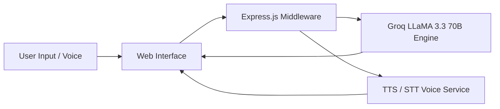

<div align="center">

# 🇮🇳 BharatBhasha AI — Next-Gen Indic Multilingual AI Platform

### *Breaking Language Barriers with Low-Latency Vernacular Conversational AI*


</div>

---

## 📌 Overview

**BharatBhasha AI** is an intelligent, low-latency multilingual assistant designed specifically for Indic languages. Built to bridge the digital divide for over 1 billion non-English speakers across India, BharatBhasha AI provides natural, context-aware conversations, speech-to-text, text-to-speech, and specialized prompt engineering tuned for regional vernacular nuances.

---

## 🌐 Supported Indic Languages

| Language | Code | Native Script | Voice Support |
|---|---|---|---|
| **Hindi** | `hi` | हिन्दी | ✅ Full TTS & STT |
| **Gujarati** | `gu` | ગુજરાતી | ✅ Full TTS & STT |
| **Marathi** | `mr` | मराठी | ✅ Full TTS & STT |
| **Tamil** | `ta` | தமிழ் | ✅ Full TTS & STT |
| **Telugu** | `te` | తెలుగు | ✅ Full TTS & STT |
| **Punjabi** | `pa` | ਪੰਜਾਬੀ | ✅ Full TTS & STT |
| **Bengali** | `bn` | বাংলা | ✅ Full TTS & STT |
| **Kannada** | `kn` | ಕನ್ನಡ | ✅ Full TTS & STT |
| **Malayalam** | `ml` | മലയാളം | ✅ Full TTS & STT |
| **English** | `en` | English | ✅ Full TTS & STT |

---

## ✨ Key Features

- 🚀 **Powered by Groq LLaMA 3.3 70B**: High-speed AI inference delivering human-like responses in milliseconds.
- 🎙️ **Real-Time Speech & Voice Call Mode**: Interactive voice assistant allowing hands-free conversational queries.
- 🎯 **Zero-Hallucination Prompt Rules**: Tailored Indic prompt guardrails ensuring precise, context-accurate responses.
- 🎨 **Modern Glassmorphic UI**: Ultra-responsive dashboard crafted with smooth micro-animations and intuitive controls.
- 🌐 **Web Search Integration**: Live web search augmentation for real-time information retrieval.

---

## 🏗️ Technical Architecture



---

## 🛠️ Local Setup & Running

```bash
# Clone repository
git clone https://github.com/thatvivekhingu/Bharat_Bhasha_Ai.git
cd Bharat_Bhasha_Ai

# Install dependencies
npm install

# Create environment file
cp .env.example .env

# Add your Groq API Key in .env
# GROQ_API_KEY=your_groq_api_key

# Start local server
npm start
```

Open `http://localhost:5000` in your web browser.

---

## 📄 License

This project is licensed under the **MIT License** — see the `LICENSE` file for details.
